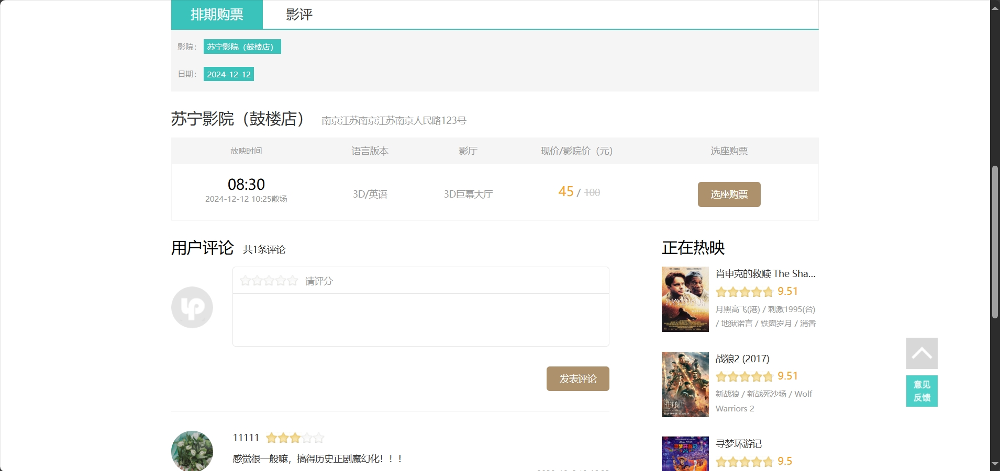
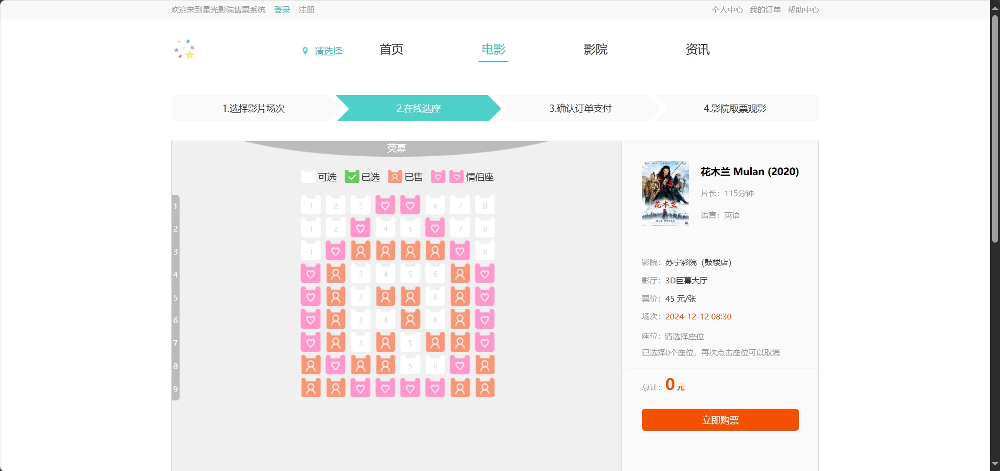
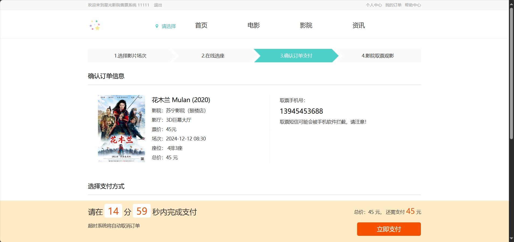
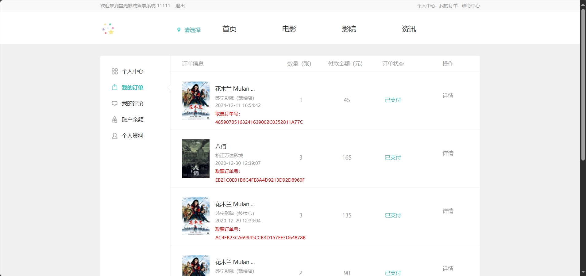
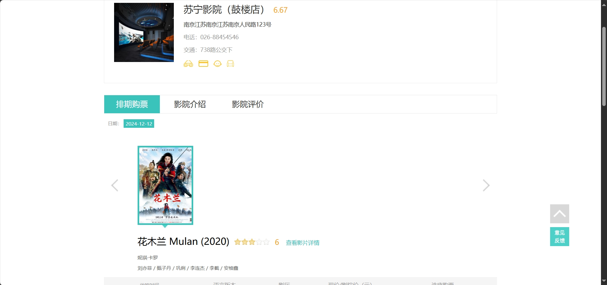
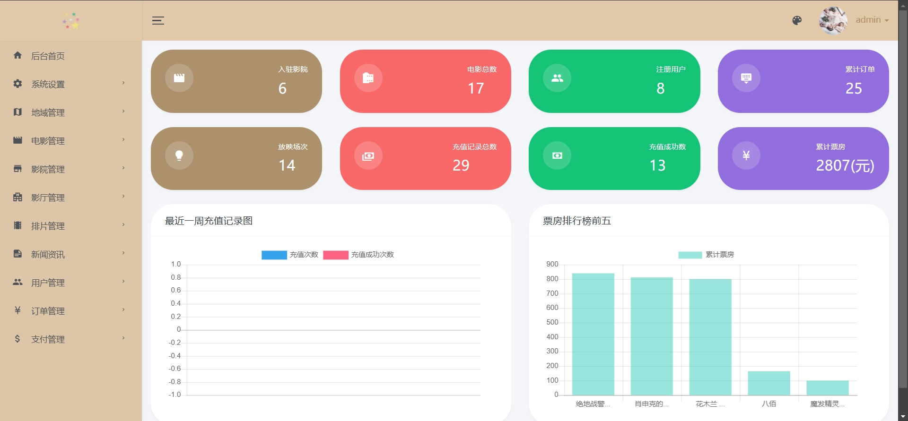
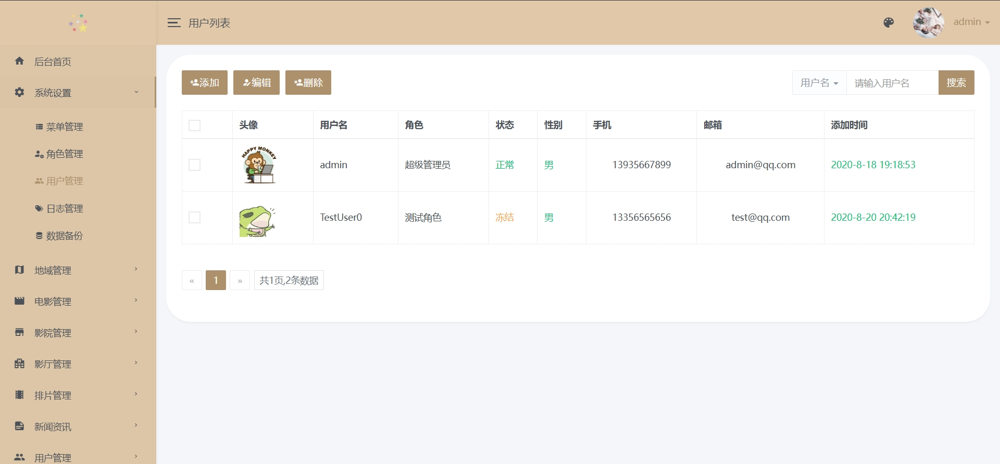
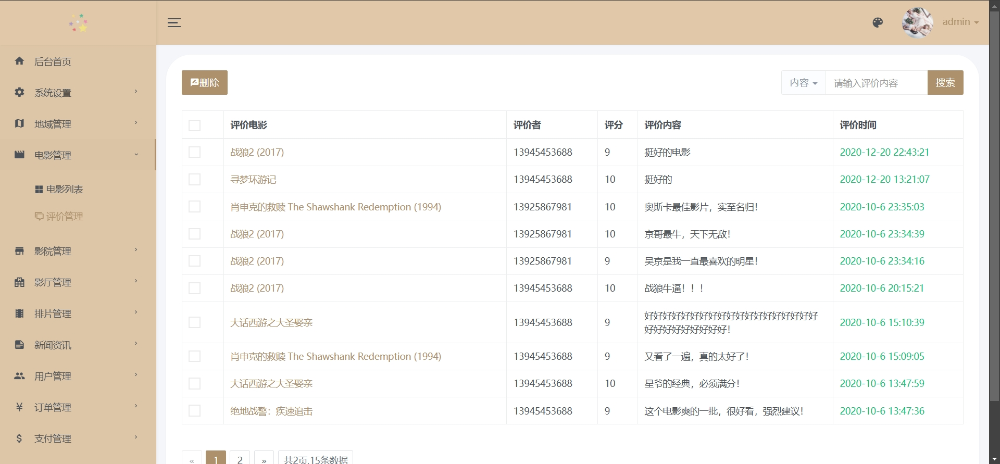
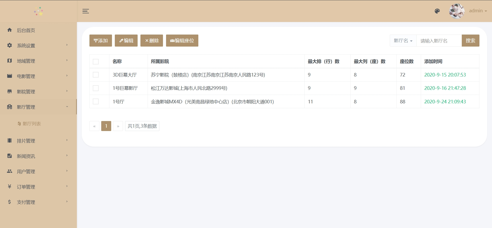
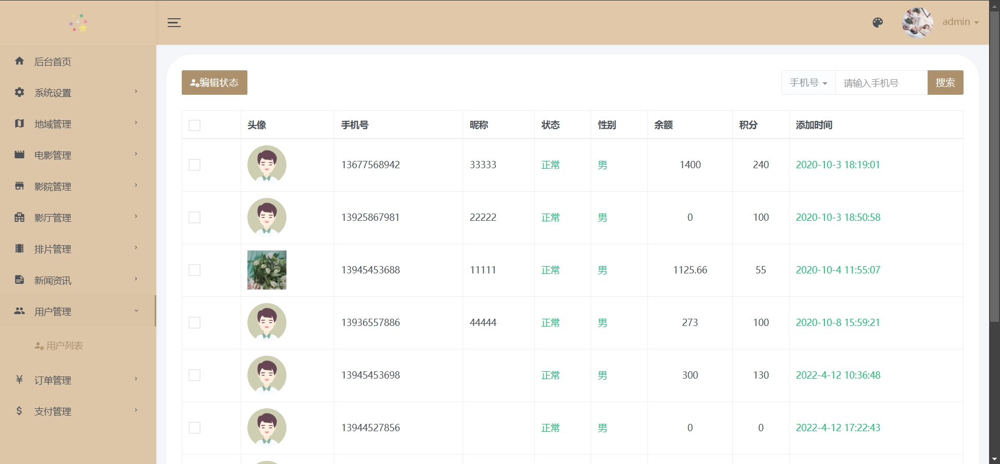

# 基于SpringBoot的星光影院售票系统(数据库加VX获取☟)
> VX：13033494971
#### 介绍
基于SpringBoot的星光影院售票系统
有BUG可留言加微

#### 软件架构
Java + SpringBoot + jpa + Mysql

#### 项目功能说明

1.  管理员功能
> + 数据显示：统计图表
> + 用户管理、地域管理、电影管理、评价管理、影院管理、影厅管理、排片管理、新闻资讯、订单管理、支付管理
2.  用户功能
> + 首页：轮播图展示、链接直达
> + 电影：正在热映、即将上映、电影介绍、排行榜
> + 影院：影城信息、影院排片、购票、选座、交易
> + 资讯：资讯分类、资讯详情
> + 个人中心：个人资料、账户信息、我的订单、我的评论、账户余额等

### 部分功能演示

### 环境需求(可免费提供)
- idea/eclipse、jdk-1.8、maven-3.8.6、mysql、nodejs等

## 有项目修改、安装调试需求 请联系微信

## 其他项目定制加微☝☝☝
